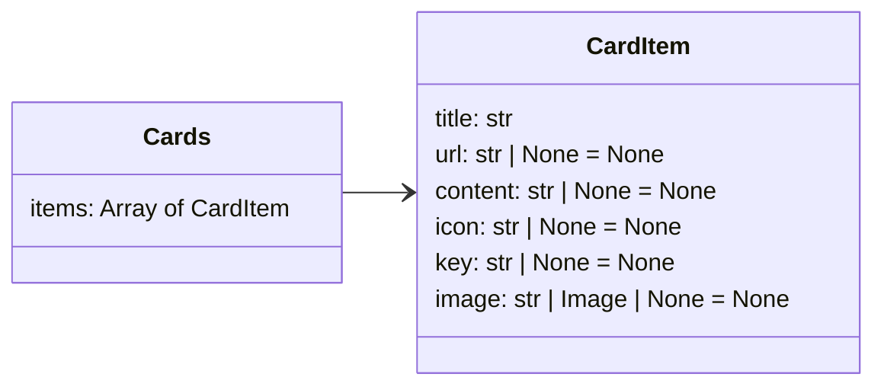

The cards extension provides eye-catching card-like controls, to display information that
usually includes images.

::cards::

- title: Zeus
  content: Lorem ipsum dolor sit amet.
  image: ./img/icons/001-zeus.png

- title: Athena
  content: Lorem ipsum dolor sit amet.
  image: ./img/icons/003-athena.png

- title: Poseidon
  content: Lorem ipsum dolor sit amet.
  image: ./img/icons/007-poseidon.png

- title: Artemis
  content: Lorem ipsum dolor sit amet.
  image: ./img/icons/021-artemis.png

- title: Ares
  content: Lorem ipsum dolor sit amet.
  image: ./img/icons/006-ares.png

- title: Nike
  content: Lorem ipsum dolor sit amet.
  image: ./img/icons/027-nike.png

::/cards::

<div class="credits-note">Greek Mythology icons made by <a href="https://www.flaticon.com/authors/maxicons" title="max.icons">max.icons</a> from <a href="https://www.flaticon.com/" title="Flaticon">www.flaticon.com</a></div>

## How to use

Edit your `mkdocs.yml` file to include the extra CSS file from Neoteroi
mkdocs-plugins and the `neoteroi.cards` extension:

```yaml

extra_css:
  - css/neoteroi-mkdocs.css
  ...

markdown_extensions:
  - neoteroi.cards
  ...

```

## Input object

### Examples

=== "JSON"

    ```json
    ::cards::

    [
      {
        "title": "Zeus",
        "content": "Lorem ipsum dolor sit amet.",
        "image": "./img/icons/001-zeus.png"
      },
      {
        "title": "Athena",
        "content": "Lorem ipsum dolor sit amet.",
        "image": "./img/icons/003-athena.png"
      },
      {
        "title": "Poseidon",
        "content": "Lorem ipsum dolor sit amet.",
        "image": "./img/icons/007-poseidon.png"
      },
      {
        "title": "Artemis",
        "content": "Lorem ipsum dolor sit amet.",
        "image": "./img/icons/021-artemis.png"
      },
      {
        "title": "Ares",
        "content": "Lorem ipsum dolor sit amet.",
        "image": "./img/icons/006-ares.png"
      },
      {
        "title": "Nike",
        "content": "Lorem ipsum dolor sit amet.",
        "image": "./img/icons/027-nike.png"
      }
    ]

    ::/cards::
    ```

=== "YAML"

    ```yaml
    ::cards::

    - title: Zeus
      content: Lorem ipsum dolor sit amet.
      image: ./img/icons/001-zeus.png

    - title: Athena
      content: Lorem ipsum dolor sit amet.
      image: ./img/icons/003-athena.png

    - title: Poseidon
      content: Lorem ipsum dolor sit amet.
      image: ./img/icons/007-poseidon.png

    - title: Artemis
      content: Lorem ipsum dolor sit amet.
      image: ./img/icons/021-artemis.png

    - title: Ares
      content: Lorem ipsum dolor sit amet.
      image: ./img/icons/006-ares.png

    - title: Nike
      content: Lorem ipsum dolor sit amet.
      image: ./img/icons/027-nike.png

    ::/cards::
    ```

=== "File source"

    ```
    [cards(./settings.yaml)]

    [cards(./settings.json)]

    # with view options:

    [cards image-bg(./settings.yaml)]
    ```

=== "URL source"

    ```
    [cards(https://www.neoteroi.dev/examples/cards.yaml)]

    [cards(https://www.neoteroi.dev/examples/cards.json)]

    # with view options:

    [cards image-bg(https://www.neoteroi.dev/examples/cards.yaml)]
    ```

### Schema



```python

@dataclass
class Image:
    url: str
    height: int | None = None
    width: int | None = None
    alt: str | None = None


@dataclass
class CardItem:
    title: str
    url: str | None = None
    content: str | None = None
    icon: str | None = None
    key: str | None = None
    image: str | Image | None = None


@dataclass
class Cards:
    items: List[CardItem]

```

## Options

### Cards with links

Specify a `url` property in the items to have links in cards.

```yaml
- title: Zeus
  content: |
    Lorem ipsum dolor sit amet, consectetur adipiscing elit, sed do eiusmod tempor
    incididunt ut labore et dolore magna aliqua.
  image: ./img/icons/001-zeus.png
  url: https://en.wikipedia.org/wiki/Zeus
```

::cards:: image-tags

- title: Zeus
  content: Lorem ipsum dolor sit amet.
  image: ./img/icons/001-zeus.png
  url: https://en.wikipedia.org/wiki/Zeus

- title: Athena
  content: Lorem ipsum dolor sit amet.
  image: ./img/icons/003-athena.png
  url: https://en.wikipedia.org/wiki/Athena

- title: Poseidon
  content: Lorem ipsum dolor sit amet.
  image: ./img/icons/007-poseidon.png
  url: https://en.wikipedia.org/wiki/Poseidon

- title: Artemis
  content: Lorem ipsum dolor sit amet.
  image: ./img/icons/021-artemis.png
  url: https://en.wikipedia.org/wiki/Artemis

- title: Ares
  content: Lorem ipsum dolor sit amet.
  image: ./img/icons/006-ares.png
  url: https://en.wikipedia.org/wiki/Ares

- title: Nike
  content: Lorem ipsum dolor sit amet.
  image: ./img/icons/027-nike.png
  url: https://en.wikipedia.org/wiki/Nike_(mythology)

::/cards::

### Controlling the number of columns

To control the number of columns in the grid, use the `cols` view option.

```diff
cols=4
```

[cards cols="4"(./docs/cards/example-1.yaml)]

```diff
cols=2
```

[cards cols="2"(./docs/cards/example-1.yaml)]

```diff
cols=1
```

[cards cols="1"(./docs/cards/example-1.yaml)]

!!! tip "Columns and CSS rules"
    Only values between 1 and 6 are supported out of the box. To handle
    greater values, also specify a custom CSS rule in your MkDocs settings like
    the following:

    ```css
    .nt-cards.nt-grid.cols-10 {
        grid-template-columns: repeat(10, 1fr);
    }
    ```

### Using background images

To display images using background images instead of image elements, use the
`image-bg` view option.

```diff
::cards:: image-bg
```

::cards:: image-bg

- title: Zeus
  content: |
    Lorem ipsum dolor sit amet, consectetur adipiscing elit, sed do eiusmod tempor
    incididunt ut labore et dolore magna aliqua.
  image: ../img/icons/001-zeus.png

- title: Athena
  content: Lorem ipsum dolor sit amet.
  image: ../img/icons/003-athena.png

- title: Poseidon
  content: Lorem ipsum dolor sit amet.
  image: ../img/icons/007-poseidon.png

::/cards::
