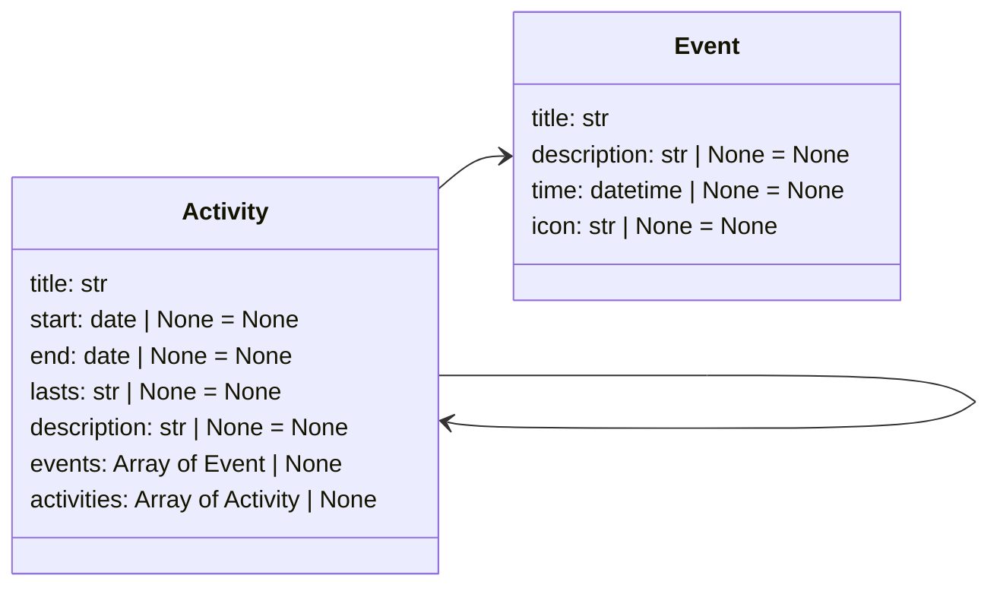

The Gantt extension provides a beautiful implementation of Gantt diagrams for MkDocs. A
Gantt diagram is great to provide detailed information of chronological events, like a
project roadmap.

[gantt(./docs/gantt/gantt-1.yaml)]

## How to use

Edit your `mkdocs.yml` file to include the extra CSS file from Neoteroi
mkdocs-plugins and the `neoteroi.projects` extension:

```yaml

extra_css:
  - css/neoteroi-mkdocs.css
  ...

markdown_extensions:
  - neoteroi.projects
  ...

```

## Input object

### Examples

=== "JSON"

    ```json
    ::gantt::
    [
        {
            "title": "Definition Phase",
            "activities": [
                {
                    "title": "Creative Brief",
                    "start": "2022-03-03",
                    "lasts": "1 day"
                },
                {
                    "title": "Graphic Design Research",
                    "start": "2022-03-02",
                    "lasts": "2 weeks"
                },
                {
                    "title": "Brainstorming / Mood Boarding",
                    "start": "2022-03-11",
                    "lasts": "2 weeks"
                }
            ]
        },
        {
            "title": "Creation Phase",
            "activities": [
                {
                    "title": "Sketching",
                    "start": "2022-03-21",
                    "lasts": "2 weeks"
                },
                {
                    "title": "Design Building",
                    "start": "2022-04-02",
                    "lasts": "4 weeks"
                },
                {
                    "title": "Refining",
                    "start": "2022-05-01",
                    "lasts": "2 weeks"
                }
            ]
        },
        {
            "title": "Feedback Phase",
            "activities": [
                {
                    "title": "Presenting",
                    "start": "2022-05-01",
                    "lasts": "3 days"
                },
                {
                    "title": "Revisions",
                    "start": "2022-05-02",
                    "end": "2022-05-31"
                }
            ]
        },
        {
            "title": "Delivery Phase",
            "activities": [
                {
                    "title": "Final delivery",
                    "start": "2022-06-05",
                    "end": "2022-06-06"
                }
            ]
        }
    ]
    ::/gantt::
    ```

=== "YAML"

    ```yaml
    ::gantt::

    - title: Definition Phase
      activities:
      - title: Creative Brief
        start: 2022-03-03
        lasts: 1 day
      - title: Graphic Design Research
        start: 2022-03-02
        end: 2022-03-10
        lasts: 2 weeks
      - title: Brainstorming / Mood Boarding
        start: 2022-03-11
        end: 2022-03-20

    - title: Creation Phase
      activities:
      - title: Sketching
        start: 2022-03-21
        end: 2022-04-01
      - title: Design Building
        start: 2022-04-02
        end: 2022-04-20
      - title: Refining
        start: 2022-04-21
        end: 2022-04-30

    - title: Feedback Phase
      activities:
      - title: Presenting
        start: 2022-04-22
        end: 2022-05-01
      - title: Revisions
        start: 2022-05-02
        end: 2022-05-10

    - title: Delivery Phase
      activities:
      - title: Final delivery
        start: 2022-05-11
        end: 2022-05-12

    ::/gantt::
    ```

=== "File source"

    ```
    [gantt(./settings.yaml)]

    [gantt(./settings.json)]
    ```

=== "URL source"

    ```
    [gantt(https://www.neoteroi.dev/examples/gantt.yaml)]

    [gantt(https://www.neoteroi.dev/examples/gantt.json)]
    ```

### Schema

The input for a Gantt diagram is a list of activities having a shape described
by the following scheme:



```python

@dataclass(frozen=True)
class Event:
    title: str
    description: str | None = None
    time: datetime | None = None
    icon: str | None = None

@dataclass(frozen=True)
class Activity:
    title: str
    start: date | None = None
    end: date | None = None
    lasts: str | None = None
    description: str | None = None
    activities: List["Activity"] | None = None
    events: List[Event] | None = None

```

###  Dates and times

The duration of activities can be described in two ways:

1. specifying `start` and `end` as dates or datetimes
2. specifying `start` and `lasts` properties

When using `lasts`, it is possible to use the following syntax:

| Days             | Example          | Alternative                    |
| ---------------- | ---------------- | ------------------------------ |
| lasts _n_ days   | _lasts 10 days_  | _days &#124; day &#124; d_     |
| lasts _n_ weeks  | _lasts 2 weeks_  | _weeks &#124; week &#124; w_   |
| lasts _n_ months | _lasts 3 months_ | _months &#124; month &#124; m_ |
| lasts _n_ years  | _lasts 3 years_  | _years &#124; year &#124; y_   |

This feature is inspired by gantt diagrams in [PlantUML](https://plantuml.com/gantt-diagram).

!!! danger "Currently unsupported"
    - Time information is currently ignored, the extension only handles dates.
      Anyway, the input objects can still have detailed date and time information.
    - The extension currently requires dates (year, month, day information): it
      cannot handle information having only number of days without month and year
      information (unlike PlantUML).

### Using events
It is possible to define events for each activity in the plan. Events require a single
date and are represented with circles.

[gantt(./docs/gantt/gantt-2.yaml)]

Examples:

=== "JSON"

    ```json
    ::gantt::
    [
        {
            "title": "Milestones",
            "events": [
                {
                    "title": "Kick-off meeting",
                    "time": "2022-03-03",
                    "icon": ":octicons-rocket-16:"
                },
                {
                    "title": "Final delivery",
                    "time": "2022-06-05",
                    "icon": ":octicons-sun-16:"
                }
            ]
        },
        {
            "title": "Definition Phase",
            "activities": [
                {
                    "title": "Graphic Design Research",
                    "start": "2022-03-02",
                    "lasts": "2 weeks"
                },
                {
                    "title": "Brainstorming / Mood Boarding",
                    "start": "2022-03-11",
                    "lasts": "2 weeks"
                }
            ]
        },
        {
            "title": "Creation Phase",
            "activities": [
                {
                    "title": "Sketching",
                    "start": "2022-03-21",
                    "lasts": "2 weeks"
                },
                {
                    "title": "Design Building",
                    "start": "2022-04-02",
                    "lasts": "4 weeks"
                },
                {
                    "title": "Refining",
                    "start": "2022-05-01",
                    "lasts": "2 weeks"
                }
            ]
        },
        {
            "title": "Feedback Phase",
            "activities": [
                {
                    "title": "Presenting",
                    "start": "2022-05-01",
                    "lasts": "3 days"
                },
                {
                    "title": "Revisions",
                    "start": "2022-05-02",
                    "end": "2022-05-31"
                }
            ]
        }
    ]
    ::/gantt::
    ```

=== "YAML"

    ```yaml
    ::gantt::

    - title: Milestones
        events:
        - title: Kick-off meeting
            time: 2022-03-03
            icon: ":octicons-rocket-16:"
        - title: Final delivery
            time: 2022-06-05
            icon: ":octicons-sun-16:"

    - title: Definition Phase
        activities:
        - title: Graphic Design Research
            start: 2022-03-02
            lasts: 2 weeks
        - title: Brainstorming / Mood Boarding
            start: 2022-03-11
            lasts: 2 weeks

    - title: Creation Phase
        activities:
        - title: Sketching
            start: 2022-03-21
            lasts: 2 weeks
        - title: Design Building
            start: 2022-04-02
            lasts: 4 weeks
        - title: Refining
            start: 2022-05-01
            lasts: 2 weeks

    - title: Feedback Phase
        activities:
        - title: Presenting
            start: 2022-05-01
            lasts: 3 days
        - title: Revisions
            start: 2022-05-02
            end: 2022-05-31

    ::/gantt::
    ```

!!! tip "Any activity can have events"
    The examples here show events in a single activity, but they can be added
    to any activity of a plan.

### Subactivities

It is possible to define more than one item per row, using subactivities. Subactivities
are always displayed inside the row of their root activity.

When defining activities, it is also possible to define the start date for the first item
in a tree of activities, and only specify how long following activities last. To add
breaks, add items having a `skip` property with a value describing a duration.

The following examples illustrate both features:

[gantt(./docs/gantt/gantt-3.yaml)]

=== "JSON"

    ```json
    ::gantt::
    {
        "start": "2022-03-01",
        "activities": [
            {
                "title": "Developer",
                "activities": [
                    {
                        "activities": [
                            {
                                "title": "Custom sign-up",
                                "lasts": "2 weeks"
                            },
                            {
                                "skip": "1 week"
                            },
                            {
                                "title": "Custom password reset",
                                "lasts": "2 weeks"
                            }
                        ]
                    }
                ]
            },
            {
                "title": "Tester",
                "activities": [
                    {
                        "activities": [
                            {
                                "skip": "5 days"
                            },
                            {
                                "title": "Tests custom sign-up",
                                "lasts": "2 weeks"
                            },
                            {
                                "skip": "1 week"
                            },
                            {
                                "title": "Tests custom password reset",
                                "lasts": "2 weeks"
                            }
                        ]
                    }
                ]
            },
            {
                "title": "Technical writer",
                "activities": [
                    {
                        "activities": [
                            {
                                "skip": "4 weeks"
                            },
                            {
                                "title": "Documents custom sign-up",
                                "lasts": "2 weeks"
                            },
                            {
                                "title": "Documents custom password reset",
                                "lasts": "2 weeks"
                            }
                        ]
                    }
                ]
            }
        ]
    }
    ::/gantt::
    ```

=== "YAML"

    ```yaml
    ::gantt::
    start: 2022-03-01
    activities:
      - title: Developer
        activities:
          - activities:
              - title: Custom sign-up
                lasts: 2 weeks
              - skip: 1 week
              - title: Custom password reset
                lasts: 2 weeks

      - title: Tester
        activities:
          - activities:
              - skip: 5 days
              - title: Tests custom sign-up
                lasts: 2 weeks
              - skip: 1 week
              - title: Tests custom password reset
                lasts: 2 weeks

      - title: Technical writer
        activities:
          - activities:
              - skip: 4 weeks
              - title: Documents custom sign-up
                lasts: 2 weeks
              - title: Documents custom password reset
                lasts: 2 weeks
    ::/gantt::
    ```

[gantt(./docs/gantt/gantt-4.yaml)]

=== "JSON"

    ```json
    ::gantt::
    [
        {
            "title": "Example",
            "start": "2022-01-01",
            "activities": [
                {
                    "title": "Feature 1",
                    "lasts": "10 day",
                    "activities": [
                        {
                            "skip": "10 days"
                        },
                        {
                            "title": "Activity 1.1",
                            "lasts": "30 days",
                            "activities": [
                                {
                                    "skip": "5 days"
                                },
                                {
                                    "title": "Activity 1.12",
                                    "lasts": "30 days"
                                }
                            ]
                        }
                    ]
                },
                {
                    "title": "Activity 2",
                    "lasts": "10 days"
                },
                {
                    "title": "Activity 3",
                    "lasts": "20 days"
                },
                {
                    "title": "Activity 2",
                    "lasts": "10 weeks"
                },
                {
                    "title": "Activity 2",
                    "lasts": "10 weeks"
                }
            ]
        }
    ]
    ::/gantt::
    ```

=== "YAML"

    ```yaml
    ::gantt::

    - title: Beginning
      start: 2022-01-01
      activities:
        - title: Feature 1
          lasts: 10 day
          activities:
            - skip: 10 days
            - title: Activity 1.1
              lasts: 30 days
              activities:
                - skip: 5 days
                - title: Activity 1.12
                  lasts: 30 days
        - title: Activity 2
          lasts: 10 week
        - title: Activity 3
          lasts: 20 days
        - title: Activity 2
          lasts: 10 week
        - title: Activity 2
          lasts: 10 week

    - title: Beginning
      start: 2022-01-01
      activities:
        - title: Activity 1
          lasts: 10 day
          activities:
            - title: Activity 1.1
              lasts: 30 days
        - title: Activity 2
          lasts: 40 week
        - title: Activity 3
          lasts: 20 days

    ::/gantt::
    ```

## Options

| Name         | Description                                                                          | Default               |
| ------------ | ------------------------------------------------------------------------------------ | --------------------- |
| id           | Configures an `id` property on the root HTML element                                 | ""                    |
| month-width  | Controls the size of the scale - represents the pixels width of a month with 30 days | 150                   |
| month-format | Controls date formatting for months                                                  | "%B %Y"               |
| no-groups    | Disables groups (flag)                                                               | False                 |
| no-years     | Disables years (flag)                                                                | False                 |
| no-weeks     | Disables weeks (flag)                                                                | False                 |
| no-quarters  | Disables quarters (flag)                                                             | False                 |
| no-days      | Disables days (flag)                                                                 | False                 |
| whole-years  | Displays whole years from January to December (flag)                                 | False                 |
| pastello     | Applies a CSS class to use a color palette with milder saturation                    | False                 |
| vlines-pace  | Controls how separator vertical lines are generated (each week or each month)        | "monthly" or "weekly" |

### Controlling the scale size

This extension produces diagrams displaying years, quarters, months, weeks, and days in
scale. To control the size of the scale, use the `month-width` option, which affects the
size of months having 30 days.

```
[gantt month-width=800(./docs/gantt/gantt-1.yaml)]
```

[gantt month-width=800(./docs/gantt/gantt-1.yaml)]

!!! tip "Displaying days"
    Days are not displayed when the default month size is used.
    When `month-width` is sufficiently big, days are displayed automatically.

### Gentler colors

It's possible to use a a different color palette with less saturated colors,
using the `pastello` flag.

```
[gantt pastello(./docs/gantt/gantt-1.yaml)]
```

[gantt pastello(./docs/gantt/gantt-1.yaml)]

### Disabling groups

To disable groups on the left side, use the `no-groups` flag.

```
[gantt no-groups(./docs/gantt/gantt-1.yaml)]
```

[gantt no-groups(./docs/gantt/gantt-1.yaml)]

### Disabling parts of the periods

Use the `no-years`, `no-weeks`, `no-quarters`, or `no-days` to disable certain
periods displayed on the top. For example, to disable years and quarters:

```
[gantt no-years no-quarters(./docs/gantt/gantt-2.yaml)]
```

[gantt no-years no-quarters(./docs/gantt/gantt-2.yaml)]

!!! warning "Days default"
    Days are displayed by default, but only if their elements width would be
    at least of 20px.

### Displaying full years

Gantt diagrams display by default the months between the smallest date and the biggest
date in the input data, from the beginning of the earliest month to the end of the latest
month. To display full years, from January to December, use the `whole-years` option.

```
[gantt whole-years(./docs/gantt/gantt-1.yaml)]
```

[gantt whole-years(./docs/gantt/gantt-1.yaml)]

### Icons support

The gantt extension integrates with [Material for MkDocs icons](https://squidfunk.github.io/mkdocs-material/reference/icons-emojis/),
like shown in the examples above. The extension also supports links to images,
like in the following example:

::gantt:: no-years no-quarters

- title: Parties
  events:
    - title: Zeus' birthday party
      time: 2022-03-03
      icon: ./img/icons/001-zeus.png
    - title: Poseidon's birthday party
      time: 2022-06-05
      icon: ./img/icons/007-poseidon.png
    - title: Hera's birthday party
      time: 2022-04-05
      icon: ./img/icons/024-hera.png

::/gantt::
