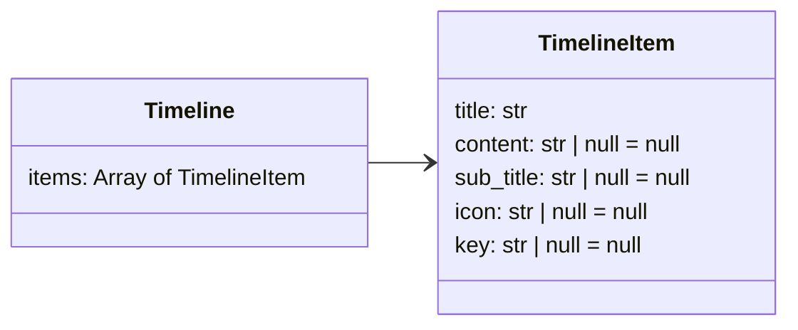

The timeline extension provides a way to display chronological events with style.
A timeline is great to present a high level overview of information happening
at different stages or times.

[timeline(./docs/timeline/timeline-1.json)]

## How to use

Edit your `mkdocs.yml` file to include the extra CSS file from Neoteroi
mkdocs-plugins and the `neoteroi.timeline` extension:

```yaml

extra_css:
  - css/neoteroi-mkdocs.css
  ...

markdown_extensions:
  - neoteroi.timeline
  ...

```

## Input object

### Examples

=== "JSON"

    ```json
    ::timeline::

    [
        {
            "title": "Launch",
            "content": "First implementation.",
            "icon": ":fontawesome-rocket:",
            "sub_title": "2022-Q1"
        },
        {
            "title": "One",
            "content": "Lorem ipsum dolor sit amet, consectetur adipiscing elit.",
            "icon": ":octicons-sun-16:",
            "key": "cyan",
            "sub_title": "2022-Q2"
        },
        {
            "title": "Two",
            "content": "Lorem ipsum dolor sit amet.",
            "icon": ":material-github:",
            "sub_title": "2022-Q3"
        },
        {
            "title": "Three",
            "content": "Lorem ipsum dolor sit amet.",
            "key": "pink",
            "sub_title": "2022-Q4"
        }
    ]

    ::/timeline::
    ```

=== "YAML"

    ```yaml
    ::timeline::

    - content: First implementation.
      icon: ':material-rocket-launch-outline:'
      sub_title: 2022-Q1
      title: Launch
    - content: Lorem ipsum dolor sit amet, consectetur adipiscing elit.
      icon: ':fontawesome-solid-gem:'
      sub_title: 2022-Q2
      title: New features
    - content: Lorem ipsum dolor sit amet.
      icon: ':material-gauge-empty:'
      sub_title: 2022-Q3
      title: More features!
    - content: Lorem ipsum dolor sit amet.
      icon: ':material-bug:'
      sub_title: 2022-Q4
      title: Bugs!

    ::/timeline::
    ```

=== "File source"

    ```
    [timeline(./settings.yaml)]

    [timeline(./settings.json)]
    ```

=== "URL source"

    ```
    [timeline(https://www.neoteroi.dev/examples/timeline.yaml)]

    [timeline(https://www.neoteroi.dev/examples/timeline.json)]
    ```

### Schema



```python

@dataclass
class TimelineItem:
    title: str
    content: str | None = None
    sub_title: str | None = None
    icon: str | None = None
    key: str | None = None


@dataclass
class Timeline:
    items: List[TimelineItem]

```

## Options

The line of a timeline can be aligned on the left, center, or right.
The default alignment for timelines is `left`.

### Center alignment

To have the line of the timeline on the center, add the `center` option:

```
[timeline center(./docs/timeline/timeline-1.json)]
```

[timeline center(./docs/timeline/timeline-1.json)]

#### Center alternate

When using `center` alignment, it is also possible to alternate the position of items,
using the `alternate` option.

```
[timeline center alternate(./docs/timeline/timeline-1.json)]
```

[timeline center alternate(./docs/timeline/timeline-1.json)]

### Right alignment

To have the line of the timeline on the right, add the `right` option:

```
[timeline right(./docs/timeline/timeline-1.json)]
```

[timeline right(./docs/timeline/timeline-1.json)]

### Rendering headings

To render headings (`h3` elements), resulting in links for the table of contents, use the
`headings` option.

```
[timeline center headings(./docs/timeline/timeline-1.json)]
```

### Icons support

The timeline extension integrates with [Material for MkDocs icons](https://squidfunk.github.io/mkdocs-material/reference/icons-emojis/),
like shown in the examples above. However, the extension also supports links to images,
like in the following example:

```
::timeline:: class="epic-timeline"
- title: Zeus does something
  content: ...
  icon: ./img/icons/001-zeus.png
  sub_title: Turn 1
- title: Athena does something
  content: ...
  icon: ./img/icons/003-athena.png
  sub_title: Turn 2
- title: Poseidon does something
  content: ...
  icon: ./img/icons/007-poseidon.png
  sub_title: Turn 3
::/timeline::
```

::timeline:: class="epic-timeline"
- title: Zeus does something
  content: ...
  icon: ./img/icons/001-zeus.png
  sub_title: Turn 1
- title: Athena does something
  content: ...
  icon: ./img/icons/003-athena.png
  sub_title: Turn 2
- title: Poseidon does something
  content: ...
  icon: ./img/icons/007-poseidon.png
  sub_title: Turn 3
::/timeline::

### Styling

To apply custom styles to a timeline, assign a custom `id` or `class` to it, and apply
custom CSS rules to the mkdocs configuration:

```
::timeline:: class="epic-timeline"

...

::timeline:: id="epic-timeline"
```

_mkdocs.yml_

```yaml
extra_css:
  - css/example.css
```

_css/example.css_

```css
.epic-timeline .nt-timeline-dot .icon {
    color: white;
    background: white;
    border-radius: 50%;
}
```

To apply a class to a particular item of the timeline, assign a `key` property
to it.

```
::timeline:: class="epic-timeline"
- title: Zeus does something
  key: zeus
  content: ...
  icon: ./img/icons/001-zeus.png
  sub_title: Turn 1
- title: Athena does something
  key: athena
  content: ...
  icon: ./img/icons/003-athena.png
  sub_title: Turn 2
- title: Poseidon does something
  key: poseidon
  content: ...
  icon: ./img/icons/007-poseidon.png
  sub_title: Turn 3
::/timeline::
```
