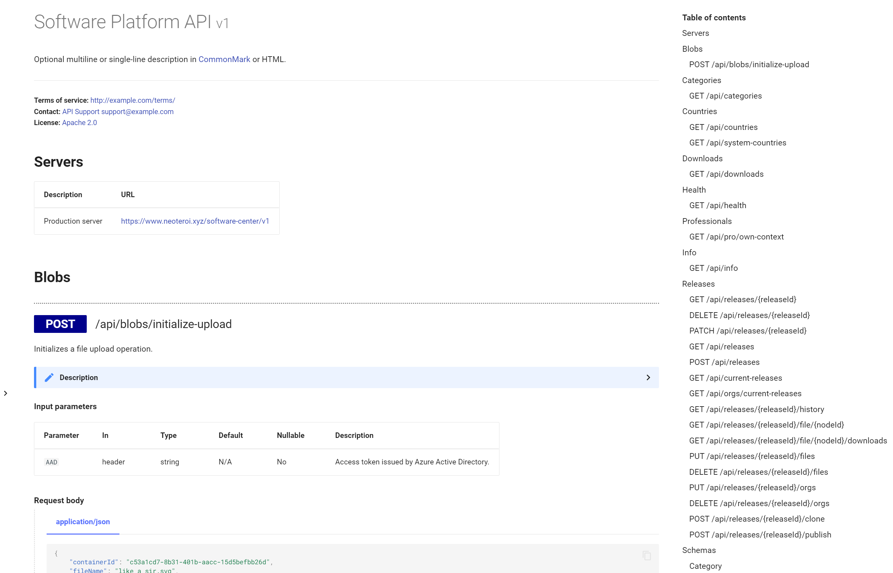
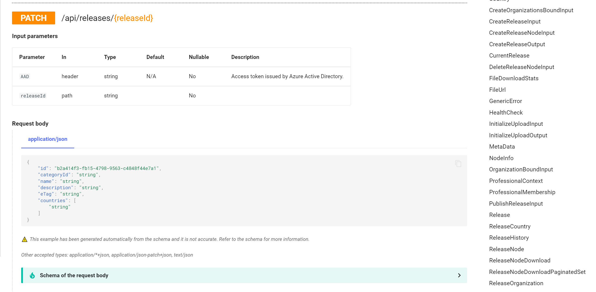

Plugin for MkDocs to generate human readable documentation from [OpenAPI
Documentation](https://swagger.io/specification/) **Version 3** (also known as
Swagger documentation).

## How to use

Install using `pip install neoteroi-mkdocs`.
Configure this plugin in the MkDocs configuration file:

```yaml
plugins:
  - search
  - neoteroi.mkdocsoad
```

Configure a source in your Markdown file, for example having a `swagger.json`
file in your `docs` folder:

```markdown
[OAD(./docs/swagger.json)]
```

The plugin fetches the contents from the OpenAPI Specification source,
generates Markdown using [essentials-openapi](https://github.com/Neoteroi/essentials-openapi),
then writes them in the markdown file.

This configuration is sufficient to generate HTML documentation from OpenAPI
specification files. To have a better looking result, it is recommended to apply the
extra configuration steps described in the next paragraph.

### Recommended: enable PyMDown and extra CSS

This plugin was designed to generate Markdown for sites that use [Material for MkDocs](https://squidfunk.github.io/mkdocs-material/)
and three extensions from [PyMdown extensions](https://facelessuser.github.io/pymdown-extensions/).
To achieve the best results, it is recommended to enable PyMdown extensions.

- Install [PyMdown extensions](https://facelessuser.github.io/pymdown-extensions/)
  using `pip install pymdown-extensions`
- Configure the following PyMdown markdown extensions in the MkDocs
  configuration file:

```yaml
markdown_extensions:
  - pymdownx.details
  - pymdownx.superfences
  - pymdownx.tabbed:
      alternate_style: true
```

- Enable PyMdown integration this way:

```yaml
plugins:
  - search
  - neoteroi.mkdocsoad:
      use_pymdownx: true
```

- Download a copy of [`neoteroi.mkdocsoad.css` file](/mkdocs-plugins/intro/) and
  configure it as extra file in your MkDocs configuration:

```yaml
extra_css:
  - css/mkdocsoad.css
```

Example result:



!!! danger "Soon changing..."
    This feature is currently shipped as plugin for MkDocs, it will be modified
    to be an extension for Python Markdown.

## Supported sources for OpenAPI Documentation

| Source                         | Example                                                     |
| :----------------------------- | :---------------------------------------------------------- |
| YAML file                      | `[OAD(./docs/swagger.yaml)]`                                |
| JSON file                      | `[OAD(./docs/swagger.json)]`                                |
| URL returning YAML on HTTP GET | `[OAD(https://example-domain.net/swagger/v1/swagger.yaml)]` |
| URL returning JSON on HTTP GET | `[OAD(https://example-domain.net/swagger/v1/swagger.json)]` |

---


